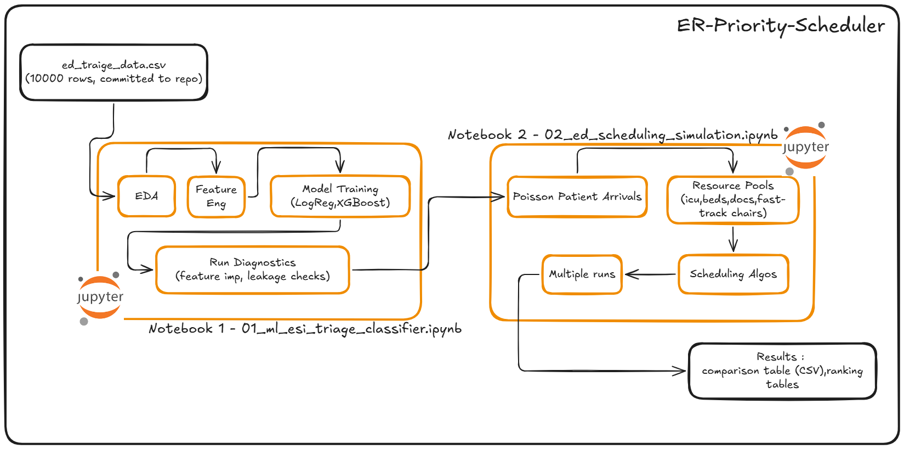
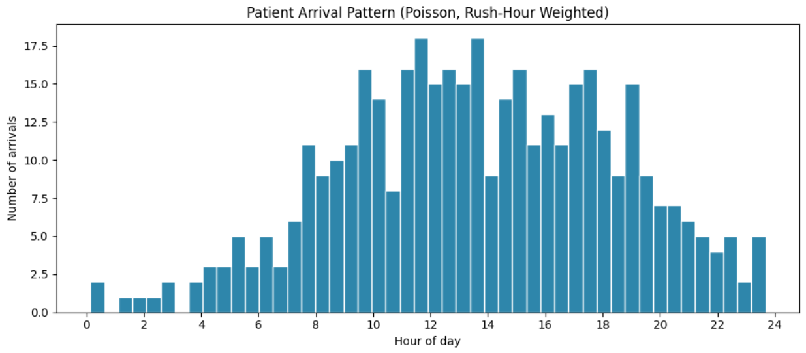
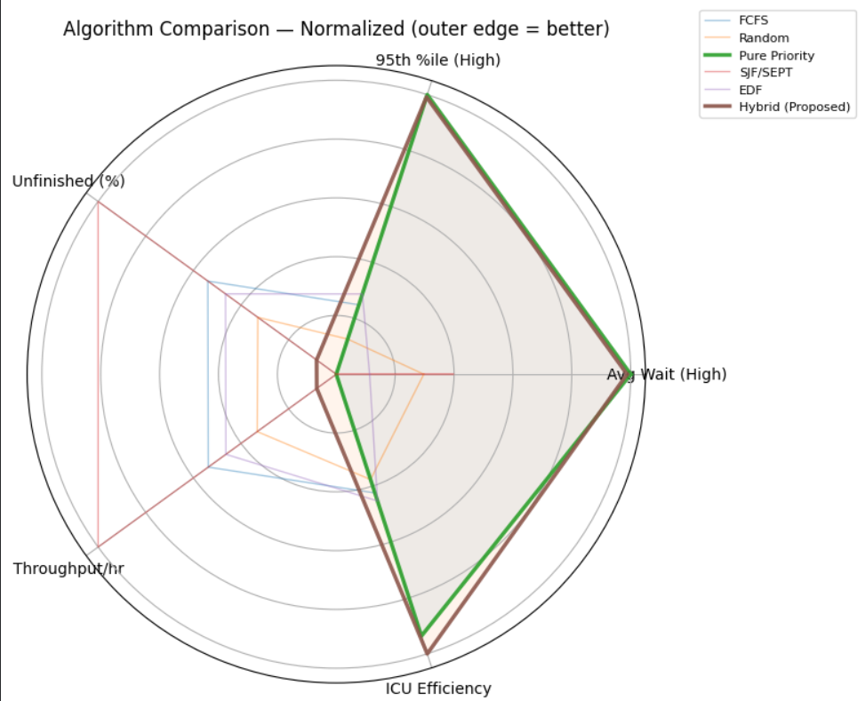
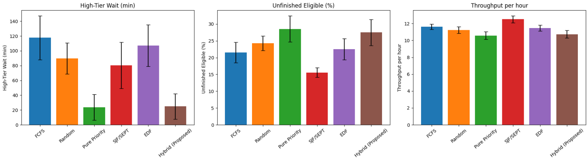
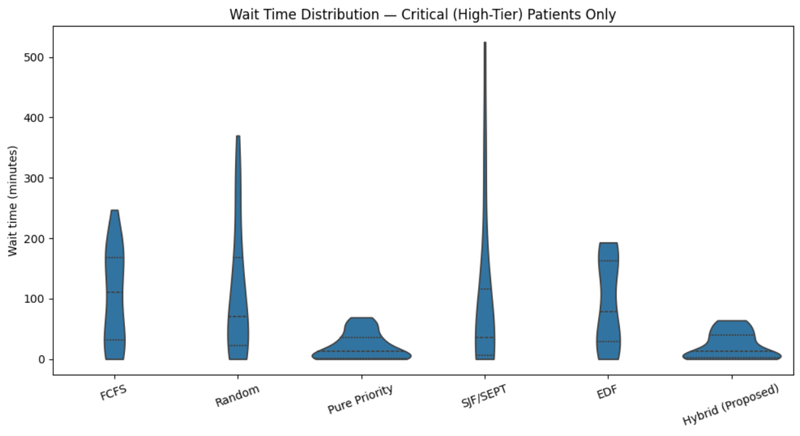
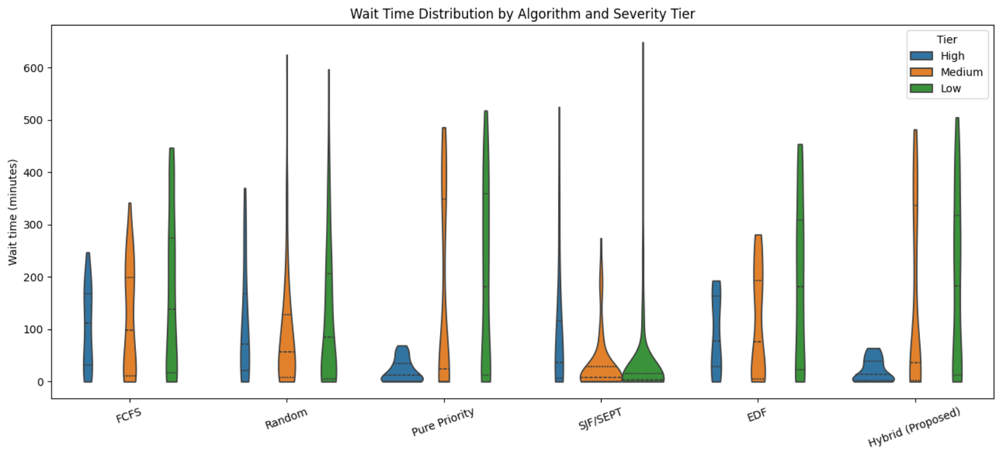
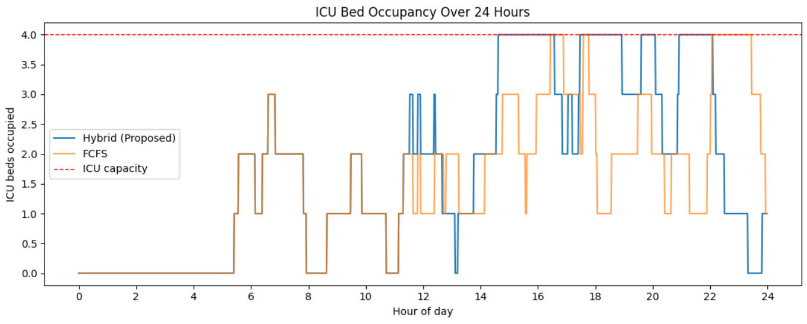

# ER-Priority-Scheduler

Simulating a hospital emergency room under real constraints — unpredictable
arrivals, limited beds and doctors — to design and benchmark a scheduling
algorithm that treats critical patients fast without leaving anyone else
behind.

**Headline result:** a hybrid priority scheduler cut critical-patient wait
times ~79% and improved ICU bed efficiency ~26% vs. first-come-first-served,
benchmarked against five other scheduling strategies across 30+ randomized
simulation runs.

---

## 1. The Problem

Emergency departments run on a hard tradeoff: **severity** (treat the
sickest first), **fairness** (don't let anyone wait forever), and
**efficiency** (don't waste scarce beds and doctor time). Optimizing
purely for one of these makes the others worse — a system that only
prioritizes severity can starve low-acuity patients indefinitely; a system
that only optimizes throughput can leave critical patients waiting behind
a queue of quick, minor cases. This project simulates that tradeoff
directly and designs an algorithm that tries to balance all three.

---

## 2. What This Project Does

Two independent notebooks:

- **`02_ed_scheduling_simulation.ipynb`** (the core of this project) —
  simulates patient arrivals, resource constraints, and six competing
  scheduling algorithms.
- **`01_ml_esi_triage_classifier.ipynb`** (supplementary) — predicts
  patient urgency from vitals, standing in for a real triage system that
  would feed severity scores into the scheduler.

The simulation only needs a severity tier per patient — it doesn't care
whether that tier came from the ML notebook, a rules engine, or a real
triage nurse.

---

## 3. The Simulation — Design & Realism

### 3.1 Realism decisions

- **Arrivals** follow a non-homogeneous Poisson process, with arrival
  rate weighted by hour to produce genuine rush-hour clustering rather
  than a fixed schedule.

  

  *Why this image is here: it's the evidence behind the "realistic
  arrivals" claim — without it, "Poisson-driven" is just an assertion.
  This shows the actual simulated arrival counts clustering around
  rush hours as designed, with natural random variation hour to hour.*

- **Resources** are split into three pools (ICU beds, general beds,
  fast-track chairs) with two independent doctor pools (main-ED,
  fast-track) — matching how real EDs physically separate low-acuity
  fast-track care from the main department.
- **Treatment times** are lognormally distributed per severity tier,
  reflecting that real clinical service times are right-skewed, not
  symmetric.
- Scheduling is **non-preemptive** — once treatment starts, it runs to
  completion.

### 3.2 Six algorithms compared

| Algorithm | What it optimizes for |
|---|---|
| FCFS | Nothing — pure arrival order |
| Random | Floor baseline |
| Pure Priority Queue | Severity only, no fairness mechanism |
| SJF/SEPT | Throughput only, ignores severity |
| EDF | Deadline (arrival + clinical wait-time target) |
| **Hybrid (proposed)** | Severity + fairness + efficiency, jointly |

### 3.3 The Hybrid algorithm

P_i(t) = BETA·S_i + ALPHA·log(1 + W_i(t)) + GAMMA·(1/T_i) + Boosts

- **Logarithmic aging**, not linear — priority grows with wait time but
  with diminishing returns, so severity stays dominant early while
  guaranteeing no one waits forever.
- **Weights calibrated, not guessed** — BETA and ALPHA are solved against
  the Australasian Triage Scale's published wait-time targets, so the
  severity/fairness tradeoff has an external clinical reference point.
- **Boost-cap invariant** — a real bug we found and fixed during
  development: fairness/starvation boosts could initially sum to more
  than the severity gap between tiers, letting a long-waiting Medium
  patient occasionally outrank a fresh High patient — the opposite of
  the intended design. Boosts are now capped below that gap, verified
  against the six-algorithm benchmark below.

Full derivation and formula justification: [`docs/scheduling_algorithm.pdf`](docs/scheduling_algorithm.pdf)

### 3.4 Results

**Headline — Hybrid vs. FCFS baseline:**

| Metric | FCFS | Hybrid | Improvement |
|---|---|---|---|
| Avg wait, critical patients | 117.6 min | 24.8 min | ~79% |
| 95th %ile wait, critical patients | 270.9 min | 67.3 min | ~75% |
| ICU bed efficiency | 0.463 | 0.584 | ~26% |

**At-a-glance comparison across all six algorithms:**

*Why this image is here: this is the single image that tells the whole
story without reading anything else — Hybrid and Pure Priority (the two
clinically-relevant contenders) both push toward the outer edge across
most axes, while SJF/SEPT's shape reveals it's winning on throughput at
the direct expense of severity-related metrics.*

**Breaking that down by specific metric:**

*Why this image is here: the radar chart shows relative shape, but this
shows the actual magnitude of each metric side by side — useful for
anyone who wants real numbers, not just a normalized shape.*

**Zooming into critical patients specifically — the metric Hybrid is
designed to protect:**

*Why this image is here: this isolates the population that matters most
clinically. It shows Hybrid pulling tight toward low wait times,
closely tracking Pure Priority, and clearly separated from FCFS/Random/EDF
— which is the evidence behind the "~79% reduction" headline number,
shown as a distribution rather than just an average.*

**The full fairness picture — all tiers, all algorithms:**

*Why this image is here: the critical-only view above only tells half
the story. This shows what each algorithm does to Medium and Low-tier
patients too — which is what reveals that no algorithm is a free lunch:
protecting critical patients has to cost someone else time somewhere,
and this image shows exactly who pays that cost under each policy.*

<b>Full comparison table — all six algorithms, all metrics (click to expand)</b>

| Metric | FCFS | Random | Pure Priority | SJF/SEPT | EDF | Hybrid |
|---|---|---|---|---|---|---|
| Avg Waiting Time (all) | 157.8 | 116.3 | 166.4 | 44.5 | 163.9 | 158.5 |
| Avg Waiting Time (High) | 117.6 | 89.7 | 23.6 | 80.4 | 107.0 | 24.8 |
| 95th %ile (all) | 393.5 | 414.3 | 479.2 | 266.1 | 401.7 | 459.8 |
| 95th %ile (High) | 270.9 | 304.6 | 64.9 | 339.0 | 260.3 | 67.3 |
| High >target (%) | 76.1 | 68.8 | 54.1 | 59.5 | 74.3 | 54.0 |
| High >2x target (%) | 73.7 | 61.5 | 37.1 | 50.6 | 69.8 | 41.6 |
| ICU Efficiency | 0.463 | 0.453 | 0.571 | 0.373 | 0.469 | 0.584 |
| General Bed Efficiency | 0.130 | 0.133 | 0.102 | 0.154 | 0.129 | 0.098 |
| Fast-Track Efficiency | 0.216 | 0.216 | 0.216 | 0.216 | 0.216 | 0.216 |
| Main Doctor Utilization | 0.761 | 0.761 | 0.761 | 0.761 | 0.761 | 0.761 |
| Fast-Track Doctor Utilization | 0.790 | 0.791 | 0.791 | 0.790 | 0.791 | 0.791 |
| Throughput per hour | 11.6 | 11.2 | 10.6 | 12.5 | 11.5 | 10.7 |
| Unfinished Eligible (%) | 21.6 | 24.3 | 28.6 | 15.6 | 22.5 | 27.5 |

**Composite ranking** (severity-weighted, see Notebook 2, Cell 11 for methodology):

1. SJF/SEPT — 0.715 *(not clinically viable — ignores severity entirely, included as an efficiency-ceiling reference)*
2. **Hybrid (Proposed) — 0.551**
3. Pure Priority — 0.550
4. Random — 0.332
5. EDF — 0.203
6. FCFS — 0.172

### 3.5 A tradeoff worth naming honestly: efficiency vs. headroom

*Why this image is here: higher ICU utilization is generally good — it
means the same 4 beds are doing more useful work rather than sitting
empty while patients wait. But this chart shows Hybrid pinned at full
capacity for long stretches during peak hours, which means less
headroom to absorb a sudden additional critical arrival during that
exact window. This isn't a flaw in the scheduling logic — no algorithm
can create a 5th physical bed — but it's an honest tradeoff worth
stating rather than hiding: better utilization during peak hours is a
capacity-planning question (surge staffing, overflow protocols) as much
as a scheduling one.*

---

## 4. Honest Limitations

- All patient data is synthetic, generated with clinically-grounded
  rules — see Notebook 1's intro for full disclosure on why this matters
  for interpreting model accuracy.
- "Doctor" is modeled as a single resource unit per patient; a real
  High-tier resuscitation typically pulls in more than one provider.
  Known simplification, noted as a v2 extension.
- No algorithm eliminates the underlying capacity constraint —
  15-29% of eligible patients go unfinished across all six policies at
  current patient volume, because doctor utilization sits near 75-80%
  regardless of scheduling rule. Scheduling redistributes who waits; it
  cannot manufacture capacity that isn't there.

---

## 5. Repo Structure
'''
er-priority-schedular/
├── README.md
├── generate_dataset.py
├── data/ed_triage_synthetic.csv
├── notebooks/
│ ├── 01_ml_esi_triage_classifier.ipynb
│ └── 02_ed_scheduling_simulation.ipynb
├── docs/
│ ├── architecture.png
│ ├── scheduling_algorithm.pdf
│ └── figures/
└── results/
'''
---

## 6. How to Run

1. `python generate_dataset.py` (optional — CSV is already committed)
2. Open `notebooks/01_ml_esi_triage_classifier.ipynb` in Colab, run all cells
3. Open `notebooks/02_ed_scheduling_simulation.ipynb` in Colab, run all cells (self-contained, doesn't require Notebook 1's output to run)

---

## 7. Supplementary: ML-Based Severity Prediction

A classifier (Logistic Regression / Random Forest / AdaBoost / XGBoost)
predicts a 3-class severity tier from patient vitals, achieving ~81%
test accuracy with XGBoost. This stands in for a real triage system in
the pipeline above — the simulation only needs a tier label, this
notebook is one way to produce one. Full model comparison, cross-
validation, and leakage diagnostics are in the notebook itself.

---

## 8. Tech Stack

Python, NumPy, Pandas, Scikit-learn, XGBoost, Matplotlib, Seaborn
